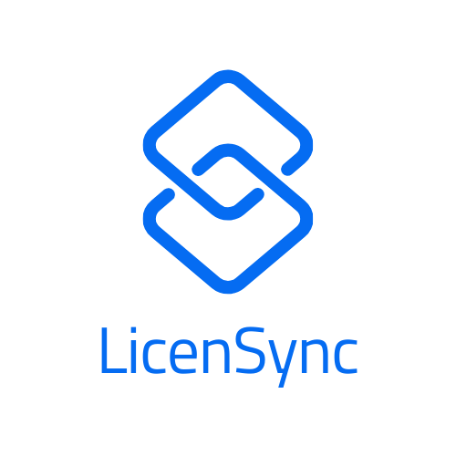

# my-project-PF

Etude d'avant projet d'une application SaaS

## Vue d'ensemble

<ins>Description courte</ins> : e-licensing musical basé sur la technologie blockchain => block-licensing

<ins>Description complète</ins> : Plateforme permettant aux artistes d'uploader leur musique afin d'en créer un hash stocké sur la blockchain, servant de preuve de création infalsifiable. Ils n'auraient donc pas besoin de passer par des organismes institutionnels (SASEM...) ou des sites de distributions (Distrokid...) souvent chers pour licensier leurs création. 
Dans une version plus aboutie, la plateforme pourrait se transformer en market place permettant aux réateurs de contenu (publicitaires, youtubers, rappeurs ayant besoin d'une production...) de payer pour l'utilisation de la musique de l'artiste, ce dernier étant rémunéré immédiatement via l'utilisation d'un smart-contract.

<ins>Besoins clients</ins> : 
* Procédé de license simplifié
* Transparence
* Sécurité
* Faible coût voir gratuité
* Flexibilité dans les termes de license
* Si modèle plateforme via smart-contract : paiement immédiat
* Suppression des intermédiares

<ins>Modèle économique</ins> :
* Compte gratuit : uploads limitées (5 par mois ?)
* Premium : uploads illimitées et par batch (albums/EP)
* Abonnement mensuel : tarif à définir en fonction du coût cloud storage et de la concurrence.

<ins>Concurrence et réponse</ins>:
* <ins>Plateformes de distribution</ins> :
  * <a href="https://distrokid.com/spotify/?utm_source=google&utm_medium=cpc&utm_campaign=19810074890&utm_adgroup=147455510152&utm_term=distrokid&utm_content=650978012823&gad=1&gclid=Cj0KCQjw4bipBhCyARIsAFsieCxhDAjllIyPNXYg2C3Dyq7xX7vkBrOoxdIdGz7A8C5AbGt7EKo1LGUaAhIFEALw_wcB" >Distrokid</a>...
  * système de distribution à prévoir ou bien modèle alternatif ?
* <ins>Organismes de gestion de droits d'auteurs</ins> : 
   * <a href="https://www.sacem.fr/">SASEM</a>, <a href="https://www.ascap.com/">ASCAP</a>...
   * Système de rémunération directe via smart-contract, pas d'intermédiaire.
* <ins>Plateformes de musique blockchain</ins> : pas une plateforme de musique ici.
* <ins>Marketplaces de license de musique</ins> : 
   * <a href="https://www.beatstars.com/">BeatStars</a> (hip-hop beats), <a href="https://www.beatport.com/">BeatPort</a> (=> djs, electronic...).
   *  Orientation stylistique à prévoir ?
* <ins>Gestionnaires d'actifs numérique</ins> : 
   * <a href="https://www.acquia.com/fr">Acquia DAM</a>... 
   * Positionnement uniquement musical ici, élargissement vidéo à prévoir ?

<ins>Cible</ins> : artistes indépendants, "bedroom producers", producteurs axés musique de publicité ou d'ambiance pour créateurs de contenu, beatmakers, jeunes groupes, artistes en recherche d'un modèle alternatif...

<ins>Aspects juridiques</ins> : 
* <ins>La blockchain commence à avoir valeur de preuve</ins> : <a href="https://www.legifrance.gouv.fr/jorf/id/JORFTEXT000037852460">Décret n° 2018-1226 du 24 décembre 2018 relatif à l'utilisation d'un dispositif d'enregistrement électronique partagé pour la représentation et la transmission de titres financiers et pour l'émission et la cession de minibons</a>. Les technologies basées sur la blockchain comme les NFTs rentrent peu à peu dans les moeurs.
* <ins>Gestion des données utilisateurs</ins> : conformité au <a href="https://www.cnil.fr/fr/professionnel">RGPD</a>.

## Entreprise/Logo/Slogan

* ### Entreprise : LicenSync

* ### Logos :

* ### Slogan : "Empowering artists, one block at a time"

## Expression des besoins

## Stack technique
* Maquettage : Figma
* Modélisation : Looping/Visual Paradigm
* Frontend : Angular/Angular Material
* Backend : ASP.NET Core
* Base de données : SQL Server
* Blockchain : Solidity, Ethereum
* Paiement : Stripe
* CI/CD : 
  * CI : Docker
  * CD : GitHub Actions
* Sécurité : 
  * 2FA : SendGrid (email), Twilio (SMS)
  * Token : JWT
  * Certificat SSL : Let's Encrypt
  * RBAC : Microsoft.AspNetCore.Authorization
  * Chiffrement mots de passe : bcrypt via Microsoft.AspNetCore.Identity
  * Validation des données entrante :
    * Coté serveur : Data Annotations
    * Coté Client : Angular Forms
  * XSS : encodeurs et CSP
  * CSRF : tokens anti-CSRF intégrés à ASP.NET Core
  * Journalisation : Serilog ou NLog
  * Monitoring : 
    * Coté app : Application Insights
    * Coté infra : AWS CloudWatch, Grafana
  * Web Application Firewall : Cloudflare, AWS WAF, Barracuda WAF
  * Rate Limiting : AspNetCoreRateLimit
* Tests :
  * Tests Unitaire : 
    * ASP.NET Core : xUnit
    * Angular : Jasmine
  * Tests d'intégration :
    * ASP.NET Core : xUnit avec TestServer
    * Angular : Protractor
  * Tests d'acceptance : Selenium, Cypress
  * Tests de performance : Appache JMeter
  * Tests de sécurité : OWASP ZAP
  * Automatisation : xUnit, Jest...

## Diagramme d'architecture

